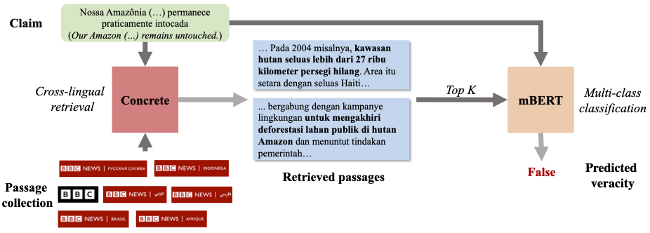

# CONCRETE

[](https://paperswithcode.com/sota/zero-shot-cross-lingual-fact-checking-on-x?p=concrete-improving-cross-lingual-fact)


Source code for the COLING'22 paper: [CONCRETE: Improving Cross-lingual Fact Checking with Cross-lingual Retrieval](https://aclanthology.org/2022.coling-1.86/).


<p align="center"></p>
We propose a fact checking framework augmented with cross-lingual retrieval for zero-shot cross-lingual fact checking, as depicted in the above figure.

## Dependencies
All required packages are listed in `requirements.txt`.

```
conda create -n concrete python=3.7
conda activate concrete
pip install -r requirements.txt
```

## Data
Please create a `data` folder under the root directory of this project and download the X-Fact data from [their repo](https://github.com/utahnlp/x-fact/tree/main/data) under this `data` directory (an example path of the tsv file is `/data/x-fact/train.all.tsv`). Please also create another directory `CORA/mDPR/retrieved_docs` and download the retrieved multilingual passages from [here](https://drive.google.com/drive/folders/11Yx4eu-ZitKPOwAbyz7JmcnNz_wURA5D?usp=sharing) into this folder (an example path of the json file is `retrieved_docs/zeroshot.xict.json`). These passages were retrieved from a multilingual passage collection using the proposed cross-lingual retriever.


## Cross-lingual Retrieval
We develop our cross-lingual retriever based on [mDPR](https://github.com/AkariAsai/CORA/tree/main/mDPR). Our cross-lingual scripts can be found under `CORA/mDPR`. The BBC passages in the passage collection can be downloaded from [here](https://drive.google.com/drive/folders/1q4riRjPTKGD-Ji0h8Dx2E1qRTHZ1A3NV?usp=sharing). This folder contains 7 sub-folders, each denotes passages in a different langauge. The articles are downloaded using [news-please](https://github.com/fhamborg/news-please). If you want to crawl news articles with a custom range of news, please refer to [this example script](https://github.com/fhamborg/news-please/blob/master/newsplease/examples/commoncrawl.py) provided by news-please. Our crawling script is also provided in the root directory of this repo `commoncrawl.py`. Below, we illustrate our scripts for running X-ICT and how to perform inference. (This step is not needed if you only want to experiment with our retrieved passages, which is described in the previous section.)

### Create X-ICT samples
Since machine translation is computationally expensive if performed on the fly, we pre-computed all translation and created X-ICT samples before running X-ICT. To do so, head over to `CORA/mDPR` and run

```
for idx in 0 1 2;
    python create_ict_samples.py --passage_dir ../../data/bbc_passages/ --out_file ../../data/bbc_passages/all_ict_samples.jsonl --num_shards 4 --shard_id $idx
```


```
python create_ict_samples.py --passage_dir ../../data/bbc_passages/ --out_file ../../data/bbc_passages/all_ict_samples-trans100.jsonl --num_shards 4 --shard_id 3 --is_eval
```

This will create X-ICT samples split into 4 shards, stored under `bbc_passages/`. Note that we use the last shard to do evaluation, hence the `--is_eval` argument in computing the last shard.

### Learning X-ICT
To learn X-ICT, simply run the following script

```
bash run_xict.sh
```
This will store the checkpoint files under `CORA/mDPR/xict_outputs`. Optionally, we provided the [trained checkpoints of X-ICT](https://drive.google.com/file/d/1pY9gNieMpEIadRHe8Lxq-tRmloxbf0ZJ/view?usp=sharing).

### Inference
To perform retrieval, we first compute the representations for all passages,

```
bash generate_multilingual_embeddings.sh
```
This will generate embeddings in `.pkl` files and store them under `CORA/mDPR/embeddings_multilingual`.


Then we perform retrieval by querying CONCRETE with each claim in X-Fact.

```
bash dense_retriever.sh
```


## Retrieval-augmented Fact Checking

### Training
To train our cross-lingual fact checker, go to the `src` directory via `cd src`. Then, run the following command:

```
python train.py --output_dir outputs --batch_size 2 --eval_batch_size 2 --max_epoch 12 --accumulate_step 32 --model_name bert-base-multilingual-cased
```

This will train our fact checking framework augmented with passages retrieved from our proposed retriever, CONCERETE.

We provide the checkpoint of the trained model for reproduction purposes. The weights can be downloaded [here](https://drive.google.com/file/d/16LO6R-Xjei08YyJxi1kzT-QBxY8Nrpf_/view?usp=sharing).

### Evaluation
Following the X-Fact paper, we use Macro F1 as the evaluation metric. To run evaluation on trained models, execute the `test.py` script as follows:

```
python test.py --checkpoint_path PATH_TO_CHECKPOINT --test_path ../data/x-fact/zeroshot.tsv --model_name bert-base-multilingual-cased
```

Here, `PATH_TO_CHECKPOINT` is the path to the checkpoint you have just trained, or you can use the weights we provided above.

@inproceedings{huang-etal-2022-concrete,
    title = "{CONCRETE}: Improving Cross-lingual Fact-checking with Cross-lingual Retrieval",
    author = "Huang, Kung-Hsiang  and
      Zhai, ChengXiang  and
      Ji, Heng",
    booktitle = "Proceedings of the 29th International Conference on Computational Linguistics",
    month = oct,
    year = "2022",
    address = "Gyeongju, Republic of Korea",
    publisher = "International Committee on Computational Linguistics",
    url = "https://aclanthology.org/2022.coling-1.86",
    pages = "1024--1035",
}
